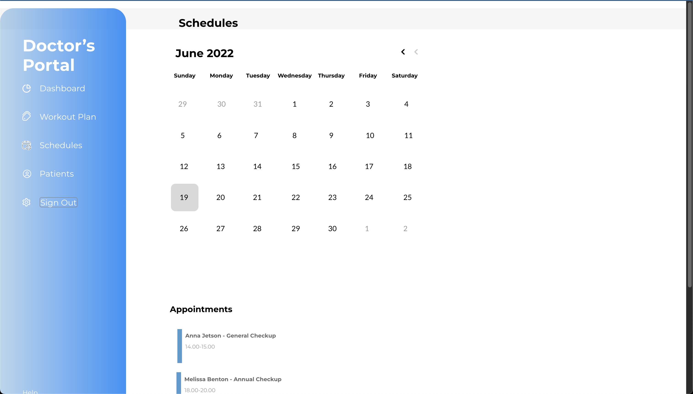

# diabetes-portal

Doctors Admin portal for diabetes rehab patients. The best non-medicinal treatment with the most promising results is physical exercise. However, it is difficult for patitents to keep motivated and get the appropriate amount of exercise.

This project was made for my CompSci 399 course at The University of Auckland. I worked with 5 other developers to develop this doctors admin webapp to assign & track the workouts and a patients Fitbit application to record & track their workouts.

We completed this project in record time, 4 weeks instead of the usual 8-10 weeks that other group got to complete it. This delay was casue due to some administrative issues from the university's side causing delay's in our AWS and other project access required for this. We are still proud of the significant progress we made with the limited resources in such a short period of time. 

### <u>`npm start` to start the web-app portal</u>

Runs the app in the development mode.\
Open [http://localhost:3000](http://localhost:3000) to view it in your browser.

The page will reload when you make changes.\
You may also see any lint errors in the console.

## Functionalities & Pages
### Dashboard 
- Shows important information about patients and workouts along with messages to access them straight away from the homepage.

---

### Workout Plan
- Doctor uses this page to assign workouts and also keep track of the patients workouts.

---

### Schedules Page
- Doctor uses this page to book appointments and keeping track of current and past patients using a calendar

---

### Patients Page
- This page is used to add, store and access all patient information.

